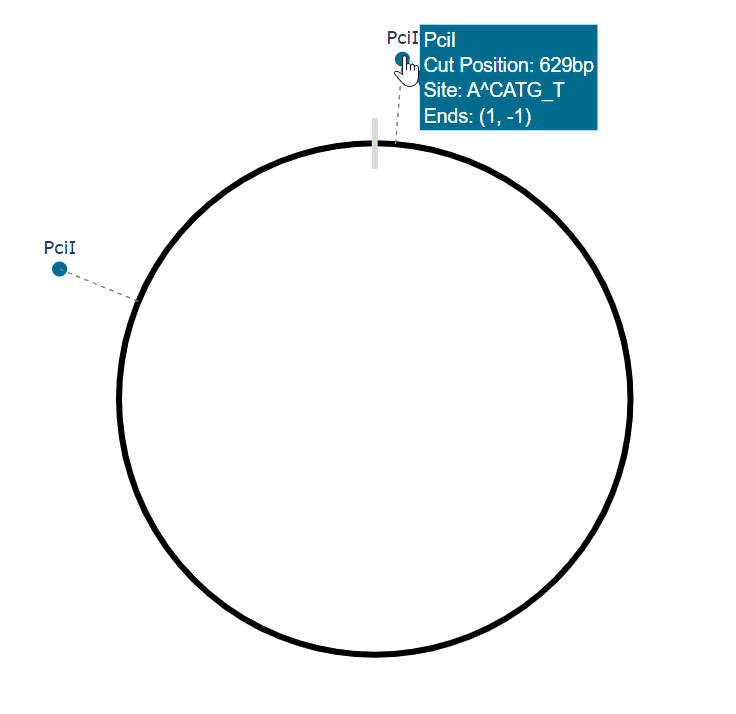

# Enzyme Map

[**Enzyme Map**](https://enzyme-map.onrender.com/) is a Flask web application for finding and visualising restriction enzyme cut sites in DNA sequences. Give it a sequence, choose from the commercially available enzymes that cut it, and get an interactive linear or circular restriction map together with a table of the resulting fragments. It's a quick way to check restriction sites in plasmids and other sequences when planning cloning or verifying a construct.

**[Try it online](https://enzyme-map.onrender.com/)**

> **Note:** The demo runs on Render's free tier, so the first load can take up to a minute while the server wakes up.

---

## Screenshots

**Linear map**


**Circular map**



---

## Features

- **Flexible sequence input:** paste a sequence (plain or FASTA), upload a `.fasta`, `.fa` or `.txt` file, or fetch a sequence directly from NCBI by **GenBank accession** (e.g. `NC_005816`).
- **Analysis options:** mark a sequence as **circular**, restrict the analysis to a **region** (start/end), and cap the **maximum number of cuts** per enzyme.
- **Enzyme selection:** review the commercially available enzymes that cut your sequence, with their recognition site and number of cuts, and choose which ones to map. Enzyme data comes from Biopython's `Restriction` module, which is based on REBASE.
- **Interactive maps:** view cut sites on a linear or circular map built with Plotly.
- **Fragment table:** see the size and position of every fragment produced by the selected enzymes.
- **Export:** save the map as a **PNG** and download the fragment table as a **CSV** (`restriction_fragments.csv`).

---

## Tech stack

- **Backend:** Python 3.11, Flask
- **Sequence analysis:** Biopython (`Restriction`, `SeqIO`, `Entrez`)
- **Visualisation:** Plotly
- **Frontend:** HTML, CSS, JavaScript

---

## Running locally

### Prerequisites

- Python 3.11 or newer
- An internet connection is needed only for the GenBank accession option. Pasting or uploading a sequence works fully offline.

Check your Python version with:

```bash
python3 --version
```

### Installation

1. **Clone the repository:**
   ```bash
   git clone https://github.com/SometimesJade/enzyme-map.git
   cd enzyme-map
   ```
2. **Create and activate a virtual environment:**

   macOS / Linux:
   ```bash
   python3 -m venv venv
   source venv/bin/activate
   ```
   Windows (PowerShell):
   ```bash
   python -m venv venv
   venv\Scripts\activate
   ```
3. **Install the dependencies:**
   ```bash
   pip install -r requirements.txt
   ```
4. **Start the app:**
   ```bash
   flask run
   ```
5. **Open** [http://127.0.0.1:5000](http://127.0.0.1:5000) in your browser. Press `Ctrl + C` in the terminal to stop the server.

---

## Usage

The app has three screens that follow on from one another:

1. **Sequence input:** provide a sequence by pasting it, uploading a file, or entering a GenBank accession. Optionally set the circular, region, and maximum-cuts options.
2. **Enzyme selection:** review the enzymes that cut your sequence and select the ones you want to map.
3. **Restriction map:** explore the linear or circular map and the fragment table, and export them as PNG or CSV.

---

## Project structure

```
enzyme-map/
├── app.py                 # Flask routes (input → analysis → map)
├── process_sequence.py    # Input handling, cleaning, validation, enzyme search
├── map_sequence.py        # Cut-site mapping, fragment calculation, Plotly maps
├── requirements.txt       # Python dependencies
├── common/                # Screenshots used in this README
├── templates/             # HTML pages
│   ├── sequence_input.html
│   ├── analyse_sequence.html
│   └── map_sequence.html
└── static/
    ├── styles/style.css   # Application styling
    └── js/main.js         # Tab switching, downloads, UI helpers
```

---

## Limitations

- Sequences are limited to roughly **1000 kbp** to keep the analysis responsive.
- GenBank lookups use NCBI Entrez and may be slower or rate-limited depending on network conditions and NCBI load.
