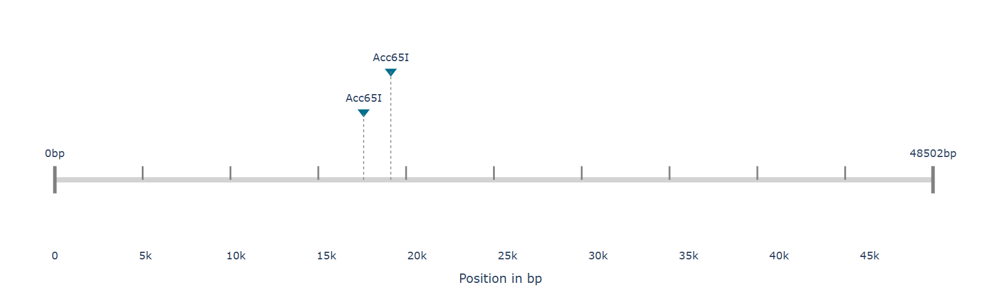
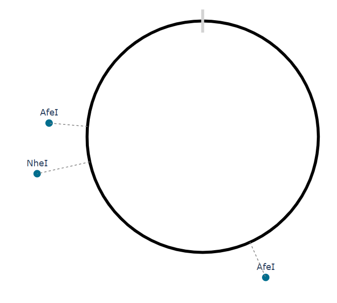

# Enzyme Map

**Enzyme Map** is a lightweight, web-based Flask application designed to quickly identify, map, and visualize restriction enzyme cutting sites within DNA sequences. It provides an intuitive interface for molecular biologists, geneticists, and bioinformatics students to streamline their cloning experiments and plasmid design workflows.

---

## Features

* **Sequence Input:** Paste raw DNA sequences or upload standard sequence formats.
* **Comprehensive Enzyme Library:** Search your sequence against a broad database of common restriction endonucleases.
* **Visual Mapping:** Clear, user-friendly visualization of exact cut site locations and resulting fragment sizes.
* **Lightweight & Fast:** Built on Flask, ensuring quick processing and easy local deployment.
  *  **Linear Map View**
  
  
  
  * **Circular Map View**

  

## Tech Stack

* **Backend:** Python 3, Flask
* **Frontend:** HTML, CSS, JavaScript

## Getting Started
Visit [this website](https://enzyme-map.onrender.com/) to use/view the application.

Follow these instructions to get a copy of the project up and running on your local machine.

### Prerequisites

Ensure you have Python 3.11+ installed on your system. You can check your Python version by running:

```bash
python --version

```

### Installation

1. **Clone the repository:**
```bash
git clone https://github.com/SometimesJade/enzyme-map.git
cd enzyme-map

```


2. **Create a virtual environment (recommended):**
```bash
python3 -m venv venv

```


3. **Activate the virtual environment:**
* On macOS and Linux:
```bash
source venv/bin/activate

```


* On Windows:
```bash
venv\Scripts\activate

```


4. **Install the dependencies:**
```bash
pip install -r requirements.txt

```


## Usage

1. Start the Flask development server:
```bash
flask run
# OR
python app.py

```


2. Open your web browser and navigate to: [http://127.0.0.1:5000](http://127.0.0.1:5000)
3. Paste your target DNA sequence into the input field, select your desired restriction enzymes, and click **Submit** to generate your map.

